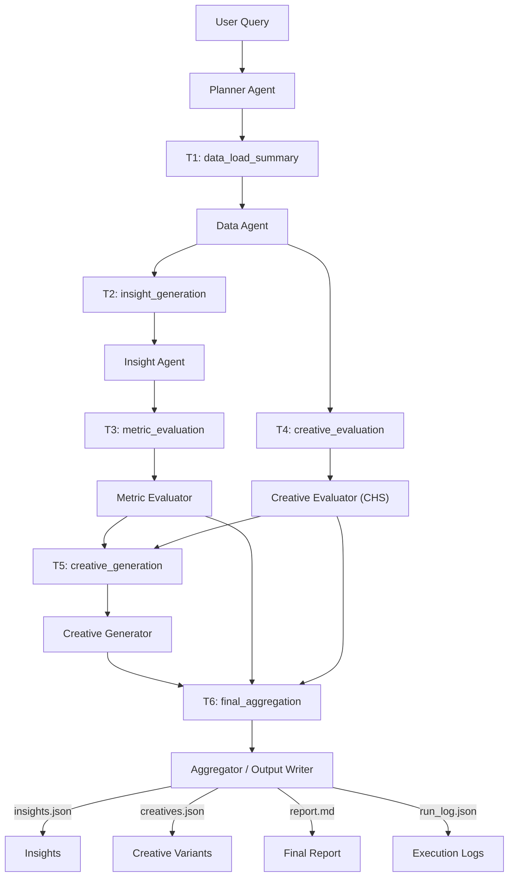

# Kasparro — Agentic Facebook Ads Performance Analyst (Assignment Submission)

This repository implements an **end-to-end multi-agent system** capable of analyzing Meta (Facebook) ad performance, diagnosing performance drop causes, validating statistically, scoring creative health using CHS, and then generating new ad creative variations grounded in data.

---

## 🔥 Core Features

| Capability | Details |
|---|---|
| Performance diagnosis | Change-detection across ROAS, CTR, Spend |
| Hypothesis generation | At campaign + global level |
| Statistical validation | Bootstrap test + proportion Z-test |
| Creative Health Score (CHS) | Behavior + Fatigue + Text Quality Composite |
| Creative generation | 3 variant styles × N tokens → headlines + primary text + CTAs |
| Export | insights.json + creatives.json + report.md + execution logs |

---

## 🧠 Full Agent Architecture

📥 User Query
    │
    ▼
🧭 1. PLANNER AGENT
   - Interprets intent (ROAS / CTR / Creative issue)
   - Generates 6-stage execution plan
   - Defines dependency graph (T1 → T2 → T3/T4 → T5 → T6)

Tasks it emits:
  T1 → Data Load / Summary
  T2 → Insight Generation
  T3 → Metric Evaluation
  T4 → Creative Health Score Evaluation (CHS)
  T5 → Creative Recommendation Generation
  T6 → Final Aggregation + Output Packaging

T1 ──▶ 🗄 2. DATA AGENT
        - Loads CSV
        - Aggregates spend/CTR/ROAS daily
        - Extracts top text terms
        - Computes creative repetition (fatigue)
        → output: data_summary.json

T2 ──▶ 🔍 3. INSIGHT AGENT
        - Compares recent vs previous windows
        - Detects CTR/ROAS movement
        - Produces hypotheses
        → output: hypotheses[]

T3 ──▶ 📊 4. METRIC EVALUATOR
        - Bootstrap ROAS significance
        - CTR proportion z-test
        → adds: metric_confidence, validated, effect_size%

T4 ──▶ 🎨 5. CREATIVE EVALUATOR (CHS)
        CHS = Behavior (0.5) + Text Quality (0.3) + Fatigue (0.2)
        - Measures creative stagnation
        - Scores weak components
        → adds: creative_confidence, chs_summary

T5 ──▶ 🧪 6. CREATIVE GENERATOR
        - Triggers only for low CTR or low CHS campaigns
        - Generates 3× creative variant styles:
              benefit-driven
              urgency-driven
              social-proof proofing
        - Each variant includes headline + message + CTA
        → output: creatives.json

T6 ──▶ 📦 7. AGGREGATOR
        final_confidence = weighted(metric + creative)
        produces:
          ✔ insights.json
          ✔ creatives.json
          ✔ report.md (human readable)

## 🧠 Full Agent Architecture

Below is the full execution graph that powers the system end-to-end.

